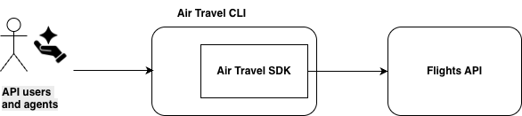

# Tip Sheet #67 - Anchor Project CLI using Typer and the Air Travel SDK

This week I explained the details of building the CLI for my anchor project. The code for these components is available in the project repository, but this file provides a summary of the overall design and implementation.

## Project Overview

The Air Travel project consists of two primary components:

1. A Python SDK that communicates with the Air Travel API
2. A command-line interface (CLI) built with Typer

The CLI acts as a thin layer over the SDK, allowing users to access API functionality directly from the terminal.

### Overall Architecture

The following diagram shows the relationship between users, the CLI, the SDK, and the underlying Flights API.



The Air Travel CLI provides a user-friendly command-line interface that delegates API operations to the Air Travel SDK. The SDK handles request construction, HTTP communication, response processing, and interaction with the Flights API.

## Architecture

The architecture shown above reflects a deliberate separation of concerns: the SDK contains the API communication logic, while the CLI focuses on the user experience.

### Air Travel SDK

The SDK is responsible for:

* Building API requests
* Managing API endpoints
* Handling HTTP communication
* Processing responses
* Raising meaningful exceptions

Because this functionality lives in the SDK, it can be reused by:

* Python scripts
* Jupyter notebooks
* Data science workflows
* Applications
* The CLI

### Air Travel CLI

The CLI is responsible for:

* Parsing command-line arguments
* Displaying results in the terminal
* Providing help documentation
* Returning appropriate exit codes

The CLI does not contain API communication logic. Instead, it imports and uses the SDK.

This separation keeps both components easier to maintain and test.

## Why Typer?

The CLI is built with Typer, a modern Python framework for creating command-line applications.

Typer provides:

* Automatic help generation
* Type-safe arguments and options
* Input validation
* Shell completion support
* Clean command definitions using Python type hints

For example:

```bash
air-travel --help
```

```bash
air-travel flights --help
```

```bash
air-travel health
```

Typer automatically generates help text and validates user input without requiring additional code.

## Example Commands

Check API health:

```bash
air-travel health
```

Search for flights:

```bash
air-travel flights --carrier AA --limit 5
```

Display the CLI version:

```bash
air-travel --version
```

## Installation

The CLI and SDK can be installed locally using wheel distributions and uv.

From the `cli` directory:

```bash
uv tool install \
  dist/air_travel_cli-0.2.0-py3-none-any.whl \
  --with ../sdk/dist/air_travel-0.2.0-py3-none-any.whl
```

Verify the installation:

```bash
uv tool list
```

Expected output:

```text
air-travel-cli v0.2.0
- air-travel
```

Verify the installed version:

```bash
air-travel --version
```

Expected output:

```text
air-travel-cli 0.2.0
```

Test connectivity to the API:

```bash
air-travel health
```

Retrieve a sample flight record:

```bash
air-travel flights --carrier AA --limit 1
```

A useful validation step is to leave the project directory entirely and run the commands again:

```bash
cd ~

air-travel --version
air-travel health
```

If these commands succeed, the CLI is running independently of the source code tree exactly as an end user would experience it.

This installation process mirrors the future publishing workflow where both the SDK and CLI will be distributed as installable Python packages.

## Repository

The implementation discussed in this week's tip sheet can be found here:

https://github.com/ryandaydev/anchor_project_air_travel/tree/main/cli

The SDK used by the CLI can be found here:

https://github.com/ryandaydev/anchor_project_air_travel/tree/main/sdk

## Key Takeaway

A useful pattern for Python projects is to separate API functionality into an SDK and then build a CLI on top of that SDK.

This approach:

* Encourages code reuse
* Reduces duplication
* Simplifies testing
* Creates multiple ways to access the same functionality
* Keeps command-line code focused on user interaction rather than API implementation details

Typer makes it straightforward to build a professional CLI while the SDK provides a reusable interface for Python developers.
